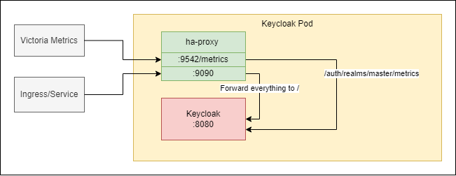

<!--
SPDX-FileCopyrightText: 2023 Deutsche Telekom AG

SPDX-License-Identifier: CC0-1.0    
-->

# Iris Keycloak Image (IKI)

## About

This project is used for setUp docker image, which will be used as a preconfigured Keycloak to run it as the
identity provider with custom extensions. This _IKI_ comes with selected
[extensions](https://www.keycloak.org/extensions.html) (here with a prometheus metrics exporter).

## Original Keycloak Image

Use original Keycloak image from quay.io/keycloak/ or mirror it if needed
to your specific repository and provide its destination inside the Dockerfile. In this version the Keycloak image with
tag **21.1.2** is used.

## Chart

It's intended to be used with the Helm chart provided in the [gitHub repo](https://github.com/telekom/iris-charts)

## Extensions

### keycloak-metrics-spi

There are the metrics extension used [keycloak-metrics-spi](https://github.com/aerogear/keycloak-metrics-spi).

When you deploy Keycloak using this image, a new REST endpoint is made
available: `https://my-keycloak-instance/auth/realms/master/metrics`.  
From this endpoint you will be able to access all metrics from all(!) realms no matter what realm is in the URL.

(!) This path is not password-protected. To prevent unauthorized access to the metrics the chart blocks the path by
using ha-proxy

To provide the metrics to the monitoring infrastructure HAProxy forwards requests from :9542/metrics to Keycloak
metrics. You can see how [HAProxy](https://github.com/telekom/iris-charts) configured
under _templates/configmap-haproxy.yaml_ directory.



## Local development

### Run Keycloak

To run an on-the-fly development Keycloak on your local machine, follow these
steps: [original documentation](https://www.keycloak.org/getting-started/getting-started-zip)

1. Download Keycloak server binaries here: https://www.keycloak.org/downloads
2. Unzip to desired location
3. Run development mode with `kc.sh start-dev` or `kc.bat start-dev`
4. Set up a realm. You may also add an identity provider redirecting to the master
   realm.

### Testing login

1. **Create a New Realm (`any-login`):**

- Log in to your Keycloak Admin Console.
- Click on the "Add realm" button in the top left corner.
- Click on the "Create realm" button
- Create realm with `any-login` name

2. **Create a New Confidential Client in the Master Realm:**

- From the Keycloak Admin Console, select the "Master" realm from the realm dropdown on the top left.
- Go to "Clients" on the left-hand sidebar and click on the "Create" button.
- Enter the following details for the new client:
    - Client ID: `anylogin`
    - Enable `Client authentication` option and disable `Direct access grants` option on the `Capability config` tab
    - Save the client settings.

3. **Add Master Realm as Identity Provider to any-login Realm:**

- In the "any-login" realm, go to the "Identity Providers" section on the left-hand sidebar.
- Click on the "Add provider" dropdown and select "Keycloak OpenID Connect."
- In the settings, configure as follows:
    - Name: `master-realm`
    - Disable `Use discovery endpoint` option to manually configure URLs.
    - Authorization URL: `<host>:<port>/realms/master/protocol/openid-connect/auth`
    - Token URL: `<host>:<port>/realms/master/protocol/openid-connect/token`
    - Client ID: `anylogin`
    - Client Secret: `anylogin-secret` (This is the Client Secret from the previously created "anylogin" client in the
      Master realm.)
    - Save the configuration.

4. **Open any-login Account Page and Sign In:**

- Go to [http://localhost:8080/realms/any-login/account/](http://localhost:8080/realms/any-login/account/) in your web
  browser.
- Click on the "Sign in" button.
- You should see "keycloak-oidc" as a selectable identity provider.

## Reset local settings

Delete the `h2` directory in your `keycloak/data` directory.

## Build

### GitLab Pipeline (example)

To build _IKI_ inside the GitLab pipeline look at the provided `.gitlab-ci.yml` which will have a jobs
called `build:extensions` and `build:image`. These steps will build the extensions and the Keycloak image together into
one Docker image.

### build:extensions

This job will build the extensions and themes and then provide these as artifacts (providers and themes) inside the pipeline.
These artifacts can then be used for ongoing steps and are needed to build the Docker image.

### build:image

This job will build the _IKI_ using Docker commands. It uses the artifacts created with `build:extensions`.

**You still need to provide your registry path (authorization for it) etc. (variables marked with TBP prefix)**

### Local

To build IKI, simply follow the steps outlined in the GitLab example.

1. **Build Extensions**: Execute the `build.sh` script located in the `extensions` directory. This will generate
   a new directory named `providers`.
2. **Build Themes**: If you have custom themes, run the `build.sh` script within the `themes` directory. This will
   generate a new directory named `themes`.
3. **Configure Docker**: Adjust the `Dockerfile` to reflect the desired image and configuration settings.
4. **Docker Image Build**: Proceed to build the Docker image.

### Multi-stage Docker build

Alternatively, you can use the multi-stage Docker build to build the image. This will build the extensions and themes in
the first stage and then copy them into the final image.

```bash
  docker build --platform linux/amd64 -t iris -f Dockerfile.multi-stage .
```

## Code of Conduct

This project has adopted the [Contributor Covenant](https://www.contributor-covenant.org/) in version 2.1 as our code of conduct. Please see the details in our [CODE_OF_CONDUCT.md](CODE_OF_CONDUCT.md). All contributors must abide by the code of conduct.

By participating in this project, you agree to abide by its [Code of Conduct](./CODE_OF_CONDUCT.md) at all times.

## Licensing

This project follows the [REUSE standard for software licensing](https://reuse.software/).
Each file contains copyright and license information, and license texts can be found in the [./LICENSES](./LICENSES) folder. For more information visit https://reuse.software/.

### REUSE

The [reuse tool](https://github.com/fsfe/reuse-tool) can be used to verify and establish compliance when new files are added. 

For more information on the reuse tool visit https://github.com/fsfe/reuse-tool.

**Check for incompliant files (= not properly licensed)**

Run `pipx run reuse lint`

**Get an SPDX file with all licensing information for this project (not for dependencies!)**

Run `pipx run reuse spdx`

**Add licensing and copyright statements to a new file**

Run `pipx run reuse annotate -c="<COPYRIGHT>" -l="<LICENSE-SPDX-IDENTIFIER>" <file>`

Replace `<COPYRIGHT>` with the copyright holder, e.g "Deutsche Telekom AG", and `<LICENSE-SPDX-IDENTIFIER>` with the ID of the license the file should be under. For possible IDs see https://spdx.org/licenses/.

**Add a new license text**

Run `pipx run reuse download --all` to add license texts for all licenses detected in the project.